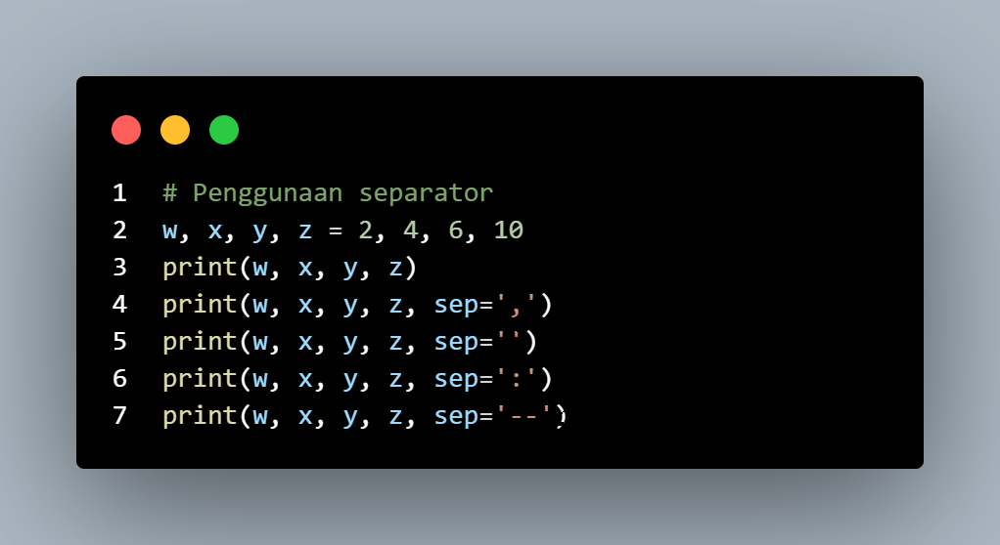
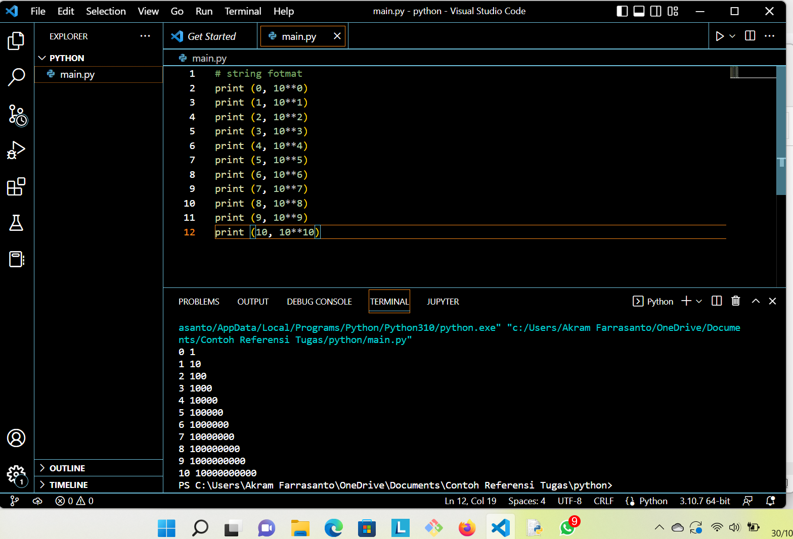
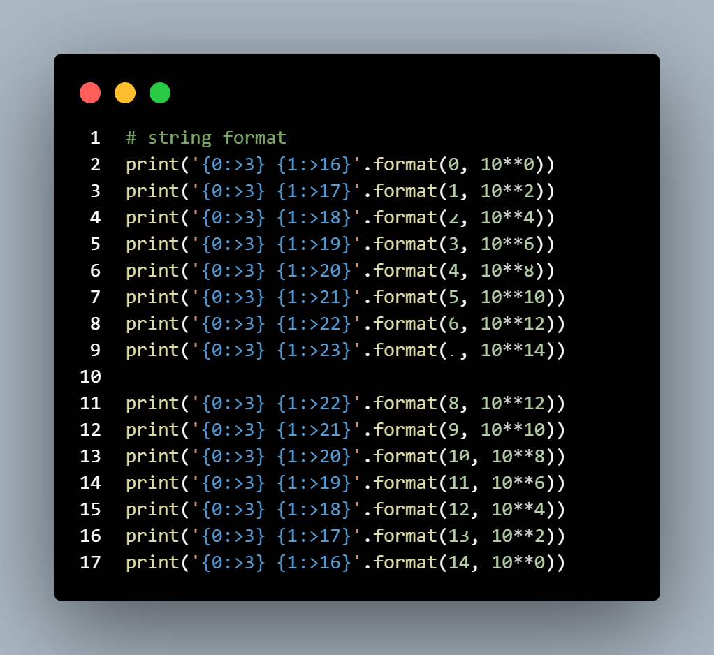
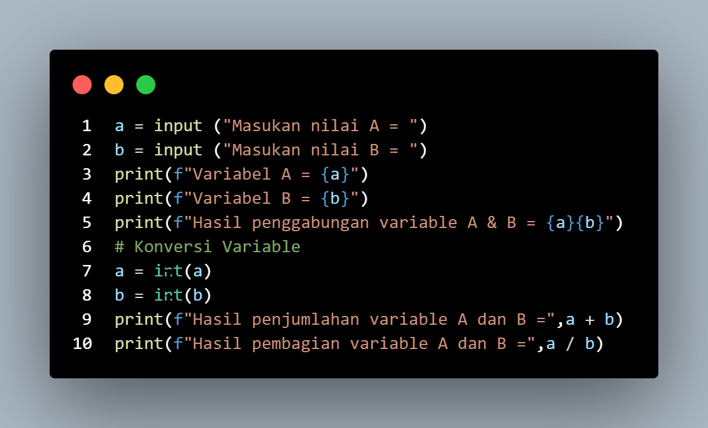
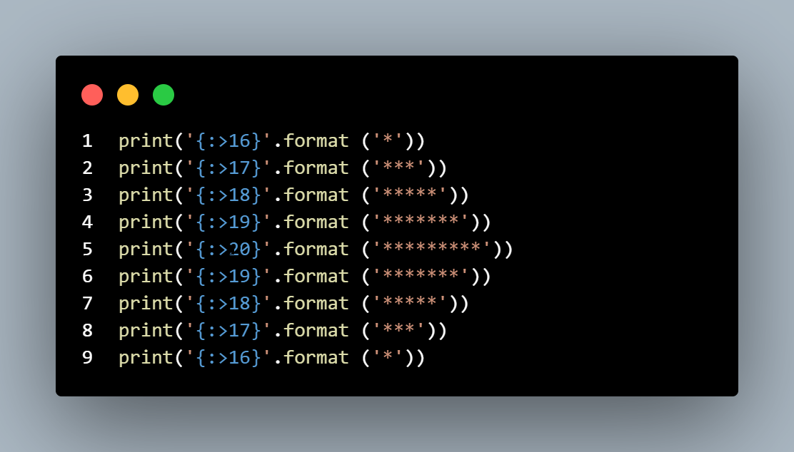
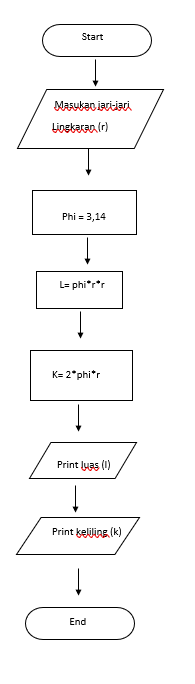
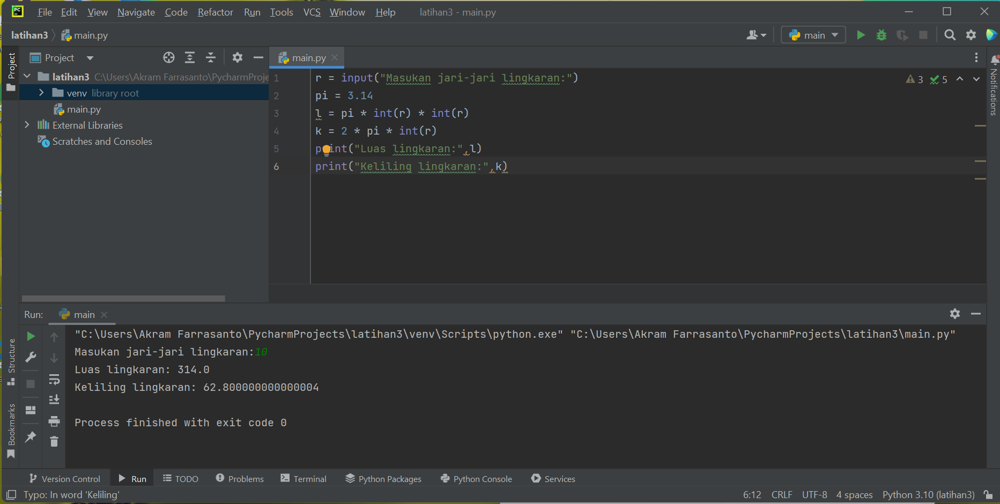

## Latihan 1

### Penggunaan end

#### Parameter end berfungsi untuk mengganti karakter terakhir bawaan yang dicetak di layar.

.png)

### Penggunaan separator

#### adalah pemisah(separator) Ketika kita memanggil fungsi print() untuk menampilkan multi argumen, python akan otomatis menambahkan karakter spasi sebagai pemisah antar argumen tersebut. Jika kita tidak ingin memisahkan spasi, maka kita menambahkan parameter (separator) saat memanggil print()

.png)

### String Format

#### Fungsi format() digunakan untuk mengatur format string yang nantinya akan dicetak atau ditampilkan ke layar.

### String Format

.png)

## Latihan 2

.png)

## Latihan 3

.png)

## Membuat Rumus Lingkaran dan Flowchart

